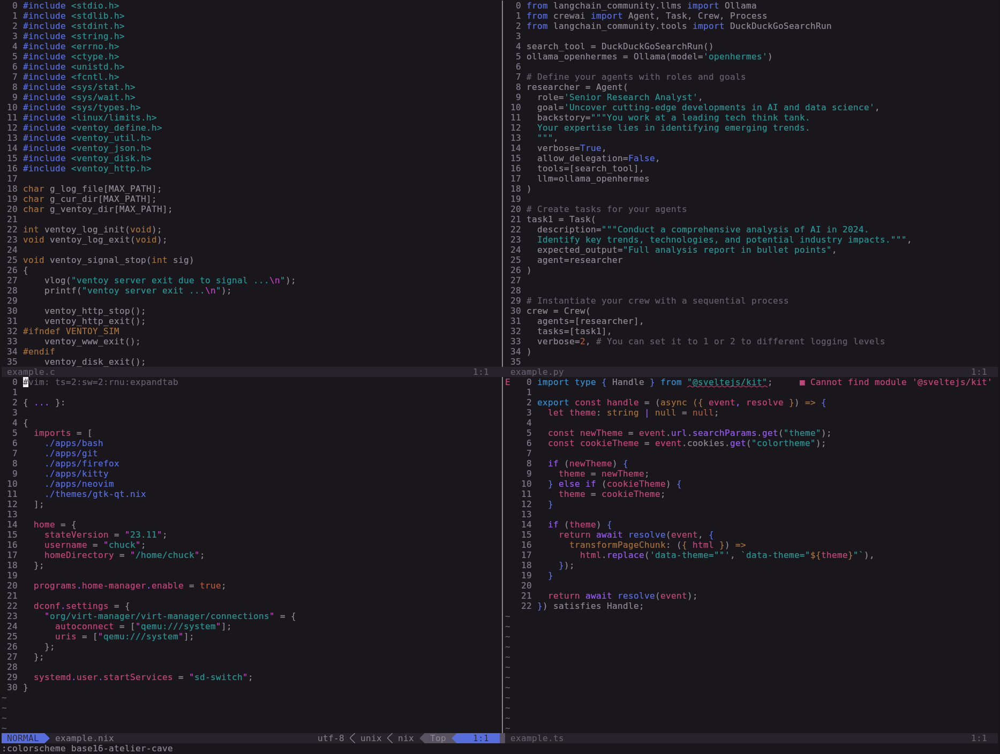
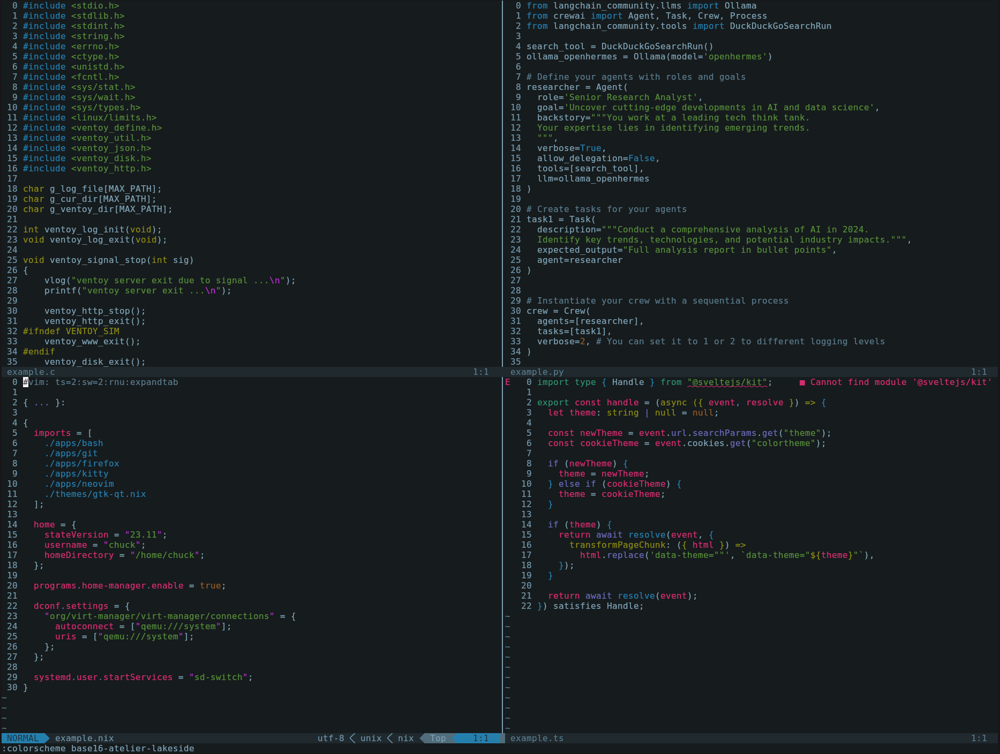
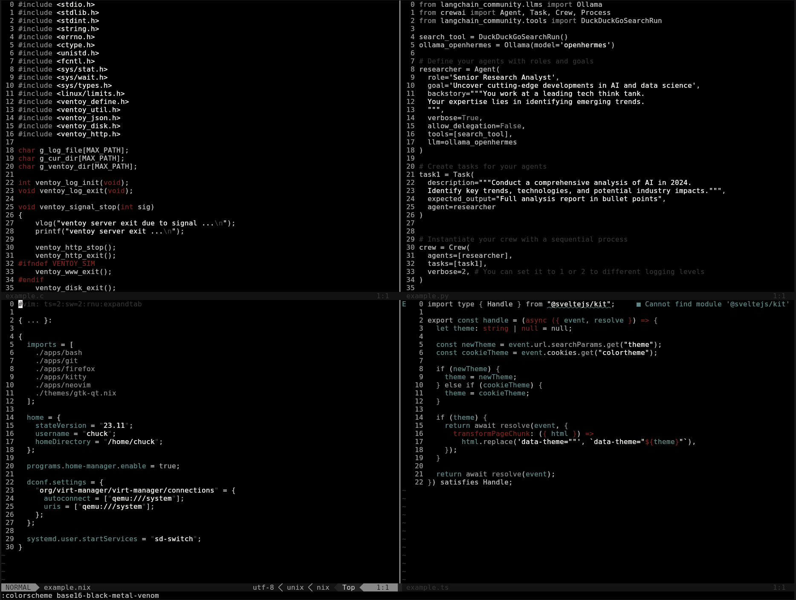
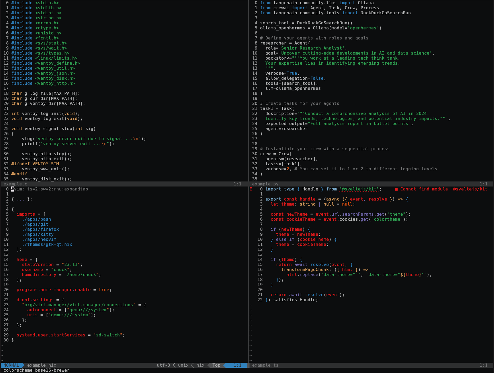
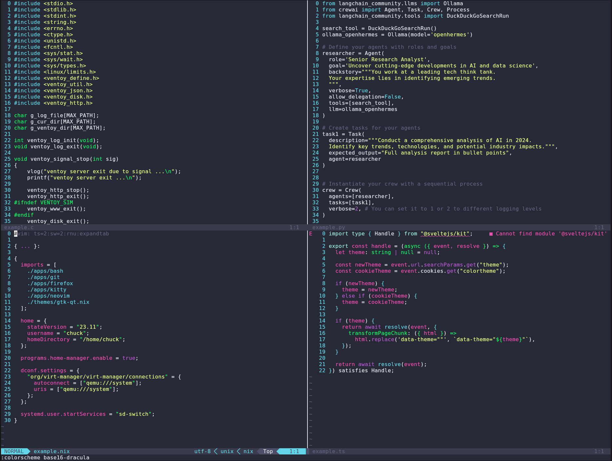
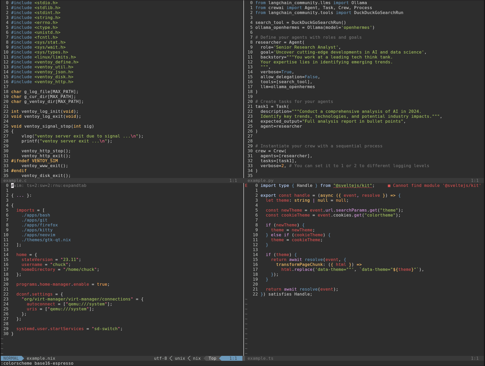
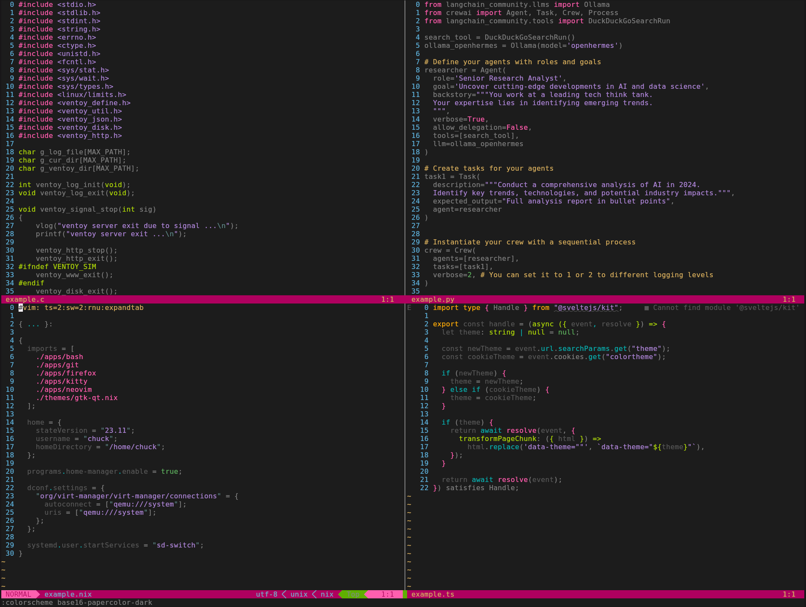
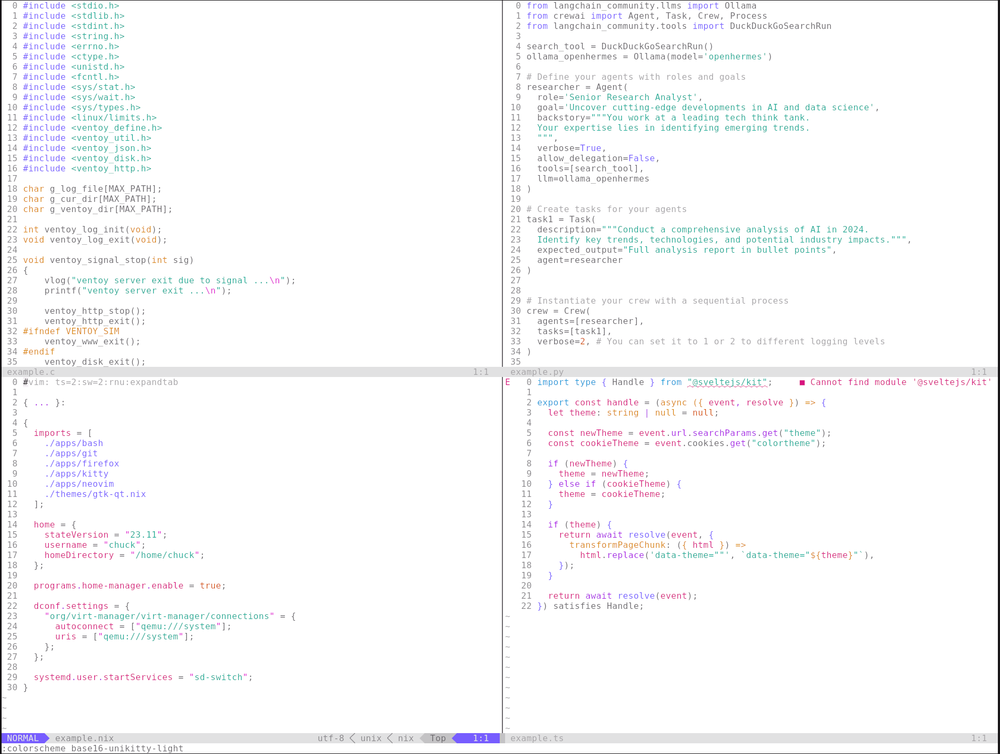

# Base16 colorschemes in nvim
## base16-3024.sh

## base16-apathy.sh

## base16-ashes.sh

## base16-atelier-cave-light.sh

## base16-atelier-cave.sh

## base16-atelier-dune-light.sh

## base16-atelier-dune.sh

## base16-atelier-estuary-light.sh

## base16-atelier-estuary.sh

## base16-atelier-forest-light.sh

## base16-atelier-forest.sh

## base16-atelier-heath-light.sh

## base16-atelier-heath.sh

## base16-atelier-lakeside-light.sh

## base16-atelier-lakeside.sh

## base16-atelier-plateau-light.sh

## base16-atelier-plateau.sh

## base16-atelier-savanna-light.sh

## base16-atelier-savanna.sh

## base16-atelier-seaside-light.sh

## base16-atelier-seaside.sh

## base16-atelier-sulphurpool-light.sh

## base16-atelier-sulphurpool.sh

## base16-atlas.sh

## base16-bespin.sh

## base16-black-metal-bathory.sh

## base16-black-metal-burzum.sh

## base16-black-metal-dark-funeral.sh

## base16-black-metal-gorgoroth.sh

## base16-black-metal-immortal.sh

## base16-black-metal-khold.sh

## base16-black-metal-marduk.sh

## base16-black-metal-mayhem.sh

## base16-black-metal-nile.sh

## base16-black-metal.sh

## base16-black-metal-venom.sh

## base16-brewer.sh

## base16-bright.sh

## base16-brogrammer.sh

## base16-brushtrees-dark.sh

## base16-brushtrees.sh

## base16-chalk.sh

## base16-circus.sh

## base16-classic-dark.sh

## base16-classic-light.sh

## base16-codeschool.sh

## base16-cupcake.sh

## base16-cupertino.sh

## base16-darktooth.sh

## base16-decaf.sh

## base16-default-dark.sh

## base16-default-light.sh

## base16-dracula.sh

## base16-edge-dark.sh

## base16-edge-light.sh

## base16-eighties.sh

## base16-embers.sh

## base16-espresso.sh

## base16-flat.sh

## base16-framer.sh

## base16-fruit-soda.sh

## base16-gigavolt.sh

## base16-github.sh

## base16-google-dark.sh

## base16-google-light.sh

## base16-grayscale-dark.sh

## base16-grayscale-light.sh

## base16-greenscreen.sh

## base16-gruvbox-dark-hard.sh

## base16-gruvbox-dark-medium.sh

## base16-gruvbox-dark-pale.sh

## base16-gruvbox-dark-soft.sh

## base16-gruvbox-light-hard.sh

## base16-gruvbox-light-medium.sh

## base16-gruvbox-light-soft.sh

## base16-harmonic-dark.sh

## base16-harmonic-light.sh

## base16-heetch-light.sh

## base16-heetch.sh

## base16-helios.sh

## base16-hopscotch.sh

## base16-horizon-dark.sh

## base16-horizon-light.sh

## base16-horizon-terminal-dark.sh

## base16-horizon-terminal-light.sh

## base16-ia-dark.sh

## base16-ia-light.sh

## base16-icy.sh

## base16-irblack.sh

## base16-isotope.sh

## base16-macintosh.sh

## base16-marrakesh.sh

## base16-material-darker.sh

## base16-material-lighter.sh

## base16-material-palenight.sh

## base16-material.sh

## base16-material-vivid.sh

## base16-materia.sh

## base16-mellow-purple.sh

## base16-mexico-light.sh

## base16-mocha.sh

## base16-monokai.sh

## base16-nord.sh

## base16-nova.sh

## base16-oceanicnext.sh

## base16-ocean.sh

## base16-onedark.sh

## base16-one-light.sh

## base16-outrun-dark.sh

## base16-papercolor-dark.sh

## base16-papercolor-light.sh

## base16-paraiso.sh

## base16-phd.sh

## base16-pico.sh

## base16-pop.sh

## base16-porple.sh

## base16-railscasts.sh

## base16-rebecca.sh

## base16-sandcastle.sh

## base16-seti.sh

## base16-shapeshifter.sh

## base16-snazzy.sh

## base16-solarflare.sh

## base16-solarized-dark.sh

## base16-solarized-light.sh

## base16-spacemacs.sh

## base16-summerfruit-dark.sh

## base16-summerfruit-light.sh

## base16-synth-midnight-dark.sh

## base16-tomorrow-night-eighties.sh

## base16-tomorrow-night.sh

## base16-tomorrow.sh

## base16-tube.sh

## base16-twilight.sh

## base16-unikitty-dark.sh

## base16-unikitty-light.sh

## base16-woodland.sh

## base16-xcode-dusk.sh

## base16-zenburn.sh

